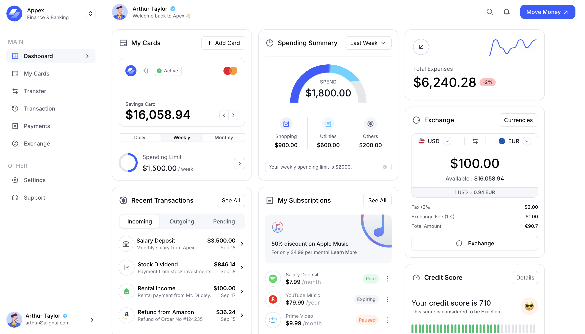

# Dodo Payments Assignment

This project is the backend and frontend solution for the **React Intern Assignment**. The backend is built with **Express.js**, and the frontend uses **Next.js** with **TailwindCSS**.

---

## Backend (Express.js)

### Overview

The backend exposes a single API endpoint (POST):

- **POST `/api/v1/echo`**
  Accepts a JSON payload with a `message` field, waits **2 seconds**, and responds with the same message.
  Implements **rate limiting** to prevent abuse: a maximum of **10 requests per 2 minutes**.
  Requests exceeding this limit return **HTTP 429**.

### Technologies Used

- **Node.js & Express.js** – Backend framework.
- **TypeScript** – Type safety and better developer experience.
- **Bun** – Fast runtime for development and used as an package manager.
- **dotenv** – Environment variable management.
- **morgan** – Request logging middleware.
- **cors** – Enables cross-origin requests.
- **express-rate-limit** – Implements rate limiting.

### Key Design Decisions

1. **Rate limiting** was implemented to satisfy the assignment requirement and protect the API.
2. **Delay of 2 seconds** simulates a real-world processing delay.
3. **CORS configuration** allows frontend hosted on a separate domain to interact with the API.
4. **Environment variables** (`PORT` and `FRONTEND_URL`) make deployment flexible.

### How to Run

#### 1. Install dependencies

```bash
cd backend-express
bun install
```

#### 2. Set up environment variables

Create a `.env` file in `backend-express`:

```
PORT=4000
FRONTEND_URL=http://localhost:3000
```

#### 3. Start the development server

```bash
bun dev
```

#### 4. Build and start in production

```bash
bun run build
bun start
```

#### 5. API Endpoint Example

**POST Request**

```
URL: http://localhost:4000/api/v1/echo
Body: { "message": "Hello World" }
```

**Response**

```json
{
  "status": "ok",
  "echo": "Hello World"
}
```

**Rate limit exceeded**

```json
{
  "message": "Too many requests, please try again later."
}
```

### Hosted Backend

The backend is deployed at:
[https://dodo-payments-assignment.onrender.com](https://dodo-payments-assignment.onrender.com)

---

## Frontend (Next.js + TailwindCSS)

### Features

1. **Figma UI Replication**
   I followed the Figma design and tried to match the spacing, colors, and fonts as closely as possible, and make reusable components for cards.

2. **API Request Queue System**

   - I added a button that users can click to send API requests. Each click adds a job to a queue.
   - The UI shows how many requests are waiting, the current status of the processing, and the responses from the backend.
   - If the backend rate-limits a request (HTTP 429), the UI shows a friendly error message with job is.

### How the Queue Works

- Every time the button is clicked, a new job with a unique ID is added to an array (`queue`).
- I used `useEffect` to watch the queue. If there are jobs, it processes the first one by sending a request to the backend.
- Once the request finishes, the response is saved in a `responses` list and removed from the queue.
- This way, requests are handled one at a time, and the UI always shows the current status and results.

### Screenshot



### How to Run Frontend

1. **Install dependencies**

```bash
   cd frontend-nextjs
   bun install
```

2. **Start development server**

```bash
   bun dev
```

3. **Visit in browser**

```
   http://localhost:3000
```

### Live Deployment

- **Main Application**: [https://frontend-nextjs-navy-phi.vercel.app/](https://frontend-nextjs-navy-phi.vercel.app/)
- **Queue System**: [https://frontend-nextjs-navy-phi.vercel.app/queue-system](https://frontend-nextjs-navy-phi.vercel.app/queue-system)

### Available Pages

- `/` - Home page
- `/queue-system` - Queue management system
